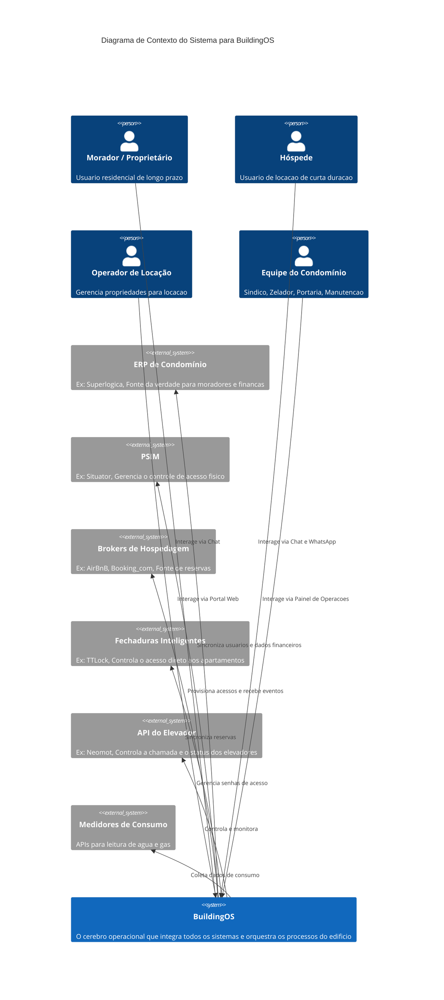
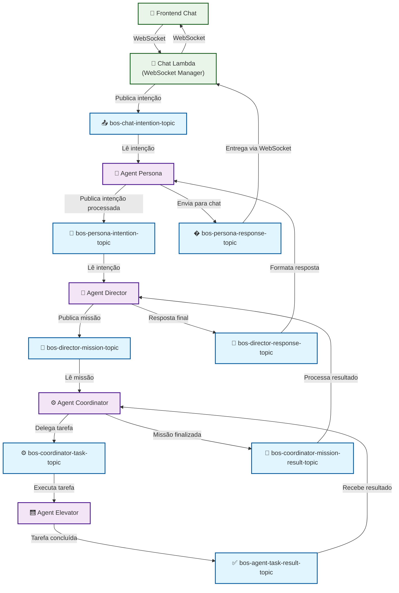

# Solution Architecture: BuildingOS (Visão Final)

## 1. Princípios Arquiteturais

*   **Arquitetura de Agentes Distribuídos:** O sistema é composto por agentes inteligentes e especializados, cada um com uma responsabilidade única. Agentes podem ser desde simples funções Lambda até componentes de IA completos com memória e RAG.
*   **Comunicação via Barramento de Eventos:** A comunicação entre os agentes principais é assíncrona, via SNS, garantindo desacoplamento, resiliência e escalabilidade.
*   **Fonte da Verdade Externa:** A base de dados do BuildingOS atua como um "cache inteligente" e um reflexo sincronizado de sistemas externos (ERP, Brokers), que são as fontes da verdade para seus respectivos domínios.
*   **Memória Compartilhada:** Os agentes utilizam um repositório de dados compartilhado (DynamoDB, S3, Kendra) para persistir o estado, documentos e conhecimento, permitindo que operem de forma *stateless*.

## 2. Arquitetura de Alto Nível (Modelo C4)

### Diagrama de Contexto do Sistema (Nível 1)

*Este diagrama mostra como o BuildingOS se encaixa em seu ambiente, interagindo com usuários e sistemas externos.*

### Diagrama de Componentes (Nível 2)

*Este diagrama mostra os principais componentes da plataforma e o fluxo de informação.*

```mermaid
graph TD
    %% 1. Interfaces (Camada Superior)
    subgraph Interfaces
        Chat("💬 Chat / WhatsApp")
        Portal("💻 Portais Web")
    end

    %% 2. Plataforma BuildingOS (Camada Principal)
    subgraph Plataforma_BuildingOS_AWS ["Plataforma BuildingOS (AWS)"]
        
        subgraph Agentes_Principais ["Agentes Principais"]
            AgentPersona("🤖 agent_persona")
            AgentDirector("🧠 agent_director")
            AgentCoordinator("⚙️ agent_coordinator")
            AgentHealthCheck("❤️ agent_health_check")
        end

        subgraph Barramento_de_Eventos_SNS ["Barramento de Eventos (SNS)"]
            IntentionTopic("intention_topic")
            MissionTopic("mission_topic")
            TaskResultTopic("task_result_topic")
            MissionResultTopic("mission_result_topic")
            IntentionResultTopic("intention_result_topic")
        end

        subgraph Agentes_de_Integracao ["Agentes de Integração"]
            AgentERP("💼 agent_erp")
            AgentPSIM("🚪 agent_psim")
            AgentBrokers("🏨 agent_brokers")
            AgentElevator("🛗 agent_elevator")
            AgentLocks("🔑 agent_locks")
            AgentMetering("💧 agent_metering")
        end

        subgraph Memoria_e_Dados ["Memória e Dados"]
            MemoryDB("🗄️ Bancos de Dados DynamoDB")
            VectorDB("🔍 Kendra Search")
            FileStorage("📄 Armazenamento de Arquivos S3")
        end
        
        LLM("☁️ AWS Bedrock")
    end

    %% 3. Sistemas Externos (Camada Inferior)
    subgraph Sistemas_Externos ["Sistemas Externos"]
        ERP_Ext("🏢 ERP Superlogica")
        PSIM_Ext("🚪 PSIM Situator")
        Brokers_Ext("🏨 APIs de Brokers")
        Elevator_Ext("🛗 API Neomot")
        Locks_Ext("🔑 API TTLock")
    end

    %% Definição dos Fluxos de Conexão

    %% Fluxo de Interação do Usuário
    Chat --> AgentPersona
    Portal --> AgentPersona
    AgentPersona -->|Responde via API| Portal
    
    %% Fluxo Principal da Missão
    AgentPersona -- "Publica Intenção" --> IntentionTopic
    IntentionTopic --> AgentDirector
    AgentDirector --> MissionTopic
    MissionTopic --> AgentCoordinator
    AgentCoordinator --> AgentERP
    AgentCoordinator --> AgentPSIM
    AgentCoordinator --> AgentBrokers
    AgentCoordinator --> AgentElevator
    AgentCoordinator --> AgentLocks
    AgentCoordinator --> AgentMetering
    
    AgentERP --> TaskResultTopic
    AgentPSIM --> TaskResultTopic
    AgentBrokers --> TaskResultTopic
    AgentElevator --> TaskResultTopic
    AgentLocks --> TaskResultTopic
    AgentMetering --> TaskResultTopic

    TaskResultTopic --> AgentCoordinator
    AgentCoordinator --> MissionResultTopic
    MissionResultTopic --> AgentDirector
    AgentDirector --> IntentionResultTopic
    IntentionResultTopic --> AgentPersona
    AgentPersona -- "Entrega Resposta" --> Chat

    %% Conexões com Memória, IA e Dados
    AgentPersona -- "R/W" --> MemoryDB
    AgentPersona -- "Usa RAG" --> VectorDB
    AgentPersona -- "Consulta" --> LLM
    AgentDirector -- "Consulta" --> LLM
    AgentCoordinator -- "R/W" --> MemoryDB
    
    AgentERP -- "R/W" --> MemoryDB
    AgentPSIM -- "R/W" --> MemoryDB
    AgentBrokers -- "R/W" --> MemoryDB
    AgentElevator -- "R/W" --> MemoryDB
    AgentLocks -- "R/W" --> MemoryDB
    AgentMetering -- "R/W" --> MemoryDB
    AgentERP -- "Docs" --> FileStorage
    
    %% Conexões com Sistemas Externos
    AgentERP <--> ERP_Ext
    AgentPSIM <--> PSIM_Ext
    AgentBrokers <--> Brokers_Ext
    AgentElevator <--> Elevator_Ext
    AgentLocks <--> Locks_Ext
    
    %% Conexões de Documentos para Interfaces
    Chat -- "Busca Docs" --> FileStorage
    Portal -- "Busca Docs" --> FileStorage
```

### Diagrama Detalhado de Fluxo de Mensagens SNS

*Este diagrama mostra o fluxo detalhado de mensagens através dos tópicos SNS para implementação do WebSocket real-time.*

## 3. Descrição dos Componentes e Fluxos

### Padrão de Nomenclatura SNS Topics

A arquitetura utiliza um padrão consistente para nomenclatura dos tópicos SNS:

**Formato:** `bos-{agent}-{action}-topic-{environment}`

| **Tópico** | **Publisher** | **Subscriber** | **Finalidade** |
|------------|---------------|----------------|----------------|
| `bos-chat-intention-topic` | Chat Lambda | Agent Persona | Intenções do usuário via WebSocket |
| `bos-persona-intention-topic` | Agent Persona | Agent Director | Intenções processadas e validadas |
| `bos-director-mission-topic` | Agent Director | Agent Coordinator | Missões estruturadas com tarefas |
| `bos-coordinator-task-topic` | Agent Coordinator | Agents (Elevator, etc.) | Tarefas específicas para execução |
| `bos-agent-task-result-topic` | Agents | Agent Coordinator | Resultados de tarefas executadas |
| `bos-coordinator-mission-result-topic` | Agent Coordinator | Agent Director | Resultados consolidados de missões |
| `bos-director-response-topic` | Agent Director | Agent Persona | Respostas finais estruturadas |
| `bos-persona-response-topic` | Agent Persona | Chat Lambda | Respostas formatadas para o usuário |

**Vantagens do Padrão:**
- ✅ **Clareza**: Nome indica quem publica no tópico
- ✅ **Consistência**: Estrutura uniforme em toda a arquitetura
- ✅ **Escalabilidade**: Fácil adição de novos tópicos específicos
- ✅ **Debugging**: Rastreabilidade clara do fluxo de mensagens
- ✅ **Manutenibilidade**: Responsabilidades bem definidas

### Agentes Principais

*   **agent_persona:**
    *   **Interface com o Usuário:** É o único ponto de contato para todas as interações dos usuários.
    *   **Inteligência Própria:** Possui uma LLM integrada, memória de conversa (DynamoDB) e utiliza Kendra para RAG (Retrieval Augmented Generation).
    *   **Primeiro Nível de Resposta:** Responde diretamente a perguntas factuais e saudações.
    *   **Filtro e Direcionamento:** Encaminha demandas complexas para o `agent_director` via `intention_topic`.
    *   **Moderação de Conteúdo:** Analisa mensagens para garantir que estejam dentro das diretrizes, alertando gestores sobre violações.

*   **agent_director:**
    *   **O Cérebro Estratégico:** Acionado por novas intenções, usa uma LLM (AWS Bedrock) para criar uma **Missão** com tarefas detalhadas.
    *   **Orquestrador de Alto Nível:** Publica a Missão no `mission_topic`.
    *   **Sintetizador de Respostas:** Acionado por uma missão completa no `mission_result_topic`, ele processa os resultados, elabora uma resposta final coesa e a publica no `intention_result_topic` para o `agent_persona`.

*   **agent_coordinator:**
    *   **O Gerente Tático:** Acionado por uma nova Missão, invoca os agentes de integração necessários para executar cada tarefa.
    *   **Controlador de Estado:** Ouve o `task_result_topic` para receber os resultados e atualiza o estado da Missão no DynamoDB.
    *   **Finalizador:** Quando todas as tarefas são concluídas, publica a Missão completa no `mission_result_topic`.

### Agentes de Integração (Tools)

*   **agent_erp:** Abstrai múltiplos ERPs (iniciando com Superlógica). Sincroniza usuários (moradores) do ERP para o BD do BuildingOS. Envia dados de consumo e reservas para o ERP e responde a consultas (boletos, taxas). Quando um documento é solicitado (ex: 2ª via de boleto), ele o armazena no S3 e retorna um link seguro.
*   **agent_psim:** Abstrai múltiplos PSIMs (iniciando com Situator). Sincroniza os usuários do BD do BuildingOS para o PSIM, gerenciando credenciais (facial, tags). Recebe eventos de acesso do PSIM e os armazena em nosso banco de dados.
*   **agent_brokers:** Recebe reservas e cancelamentos de plataformas como AirBnB e Booking.com. Armazena os dados do hóspede, cria a senha da fechadura no BD e inicia a jornada de comunicação.
*   **agent_elevator:** Responsável por chamar o elevador, monitorar sua posição e notificar o usuário. Consulta o BD para configurações específicas do condomínio (ex: nomes dos andares).
*   **agent_locks:** Comunica-se com APIs de fechaduras (ex: TTLock). Busca senhas no BD (criadas pelo `agent_brokers`) para provisionar o acesso ao apartamento.
*   **agent_metering:** Integra-se com sistemas de medição. Reporta consumo em intervalos configuráveis e consolida os dados (horário, diário, mensal) no banco de dados. Pode receber comandos para ajustar a contagem do medidor.
