[⬅️ Back to Index](../README.md)

# Solution Architecture: BuildingOS

## 1. High-Level Architecture (C4 Model: Context & Containers)

### System Context Diagram (Level 1)

*This diagram shows how BuildingOS fits into its environment.*

### Component & Communication Diagram (Level 2)

*This diagram shows the major components within BuildingOS and illustrates the central event bus communication pattern.*

```mermaid
graph TD
    subgraph User Facing
        user("👤 Building User")
    end

    subgraph "BuildingOS Platform (AWS)"
        guardian("🤖 Persona Agent (Guardian)")
        event_bus("🚌 Event Bus (SNS/SQS)")
        director("🧠 Director Agent")
        coordinator("⚙️ Coordinator (Step Functions)")
        tools("🛠️ Tools (Lambdas)")
        
        subgraph "Memory & Knowledge"
            dynamodb("🗄️ DynamoDB (Short-Term Memory)")
            kendra("📚 AWS Kendra (Knowledge Base)")
        end
    end

    subgraph "External Systems"
        bedrock("☁️ AWS Bedrock (LLM)")
        hw_admin("🏢 Building Hardware & Admin Systems")
    end

    %% Define Flows
    user -- "Sends Request" --> guardian
    guardian -- "Publishes [Intention]" --> event_bus
    guardian -- "R/W Conversation State" --> dynamodb
    
    event_bus -- "Notifies [Intention]" --> director
    director -- "Analyzes with LLM" --> bedrock
    director -- "Retrieves data from KB" --> kendra
    director -- "Publishes [Mission]" --> event_bus
    
    event_bus -- "Triggers [Mission]" --> coordinator
    coordinator -- "Dispatches [Commands]" --> tools
    
    tools -- "Executes Actions" --> hw_admin
```

## 4. Intelligent Agent Model

The core logic of BOS is orchestrated by three distinct intelligent agents:

-   **Guardian Agent (Persona Instance):** The secure, user-facing layer. It handles authentication, policy enforcement, NLU, and translates user requests into structured `Intention` manifests. Each persona (Licca, Alex) is a separate deployment of this agent.
-   **Director Agent:** The strategic brain. It uses a high-capacity LLM (via Bedrock) to analyze `Intention` manifests and create a logical plan, the `Mission` manifest.
-   **Coordinator Agent:** The tactical project manager, implemented as an AWS Step Functions state machine. It executes the `Mission` by dispatching `Commands` to tools and orchestrating the workflow.

## 5. Core Components

*This section will contain a linked view to the Component Documentation database.*

## 6. Data & Memory Architecture

The system utilizes a multi-layered memory model to manage state and knowledge:

-   **Short-Term Memory (Conversation State):** Implemented in **Amazon DynamoDB** with a TTL to manage the state of ongoing conversations.
-   **Long-Term Memory (Structured Knowledge):**
-   **Knowledge Base (Factual Data):** **AWS Kendra** is used to provide quick, factual answers to user queries (e.g., "What are the pool hours?"), offloading the LLM.

## 7. Key Architectural Decisions

*This section will contain a linked view to the Architecture Decision Records (ADRs) database.*
