# Solution Architecture: BuildingOS (Final Vision)

## 1. Architectural Principles

*   **Distributed Agent Architecture:** The system is composed of intelligent and specialized agents, each with a unique responsibility. Agents can range from simple Lambda functions to complete AI components with memory and RAG.
*   **Event Bus Communication:** Communication between main agents is asynchronous, via SNS, ensuring decoupling, resilience, and scalability.
*   **External Source of Truth:** The BuildingOS database acts as an "intelligent cache" and a synchronized reflection of external systems (ERP, Brokers), which are the sources of truth for their respective domains.
*   **Shared Memory:** Agents use a shared data repository (DynamoDB, S3, Kendra) to persist state, documents, and knowledge, allowing them to operate in a *stateless* manner.

## 2. High-Level Architecture (C4 Model)

### System Context Diagram (Level 1)

*This diagram shows how BuildingOS fits into its environment, interacting with users and external systems.*


### Component Diagram (Level 2)

*This diagram shows the main platform components and information flow.*

```mermaid
graph TD
    %% 1. Interfaces (Upper Layer)
    subgraph Interfaces
        Chat("💬 Chat / WhatsApp")
        Portal("💻 Web Portals")
    end

    %% 2. BuildingOS Platform (Main Layer)
    subgraph BuildingOS_Platform_AWS ["BuildingOS Platform (AWS)"]
        
        subgraph Main_Agents ["Main Agents"]
            AgentPersona("🤖 agent_persona")
            AgentDirector("🧠 agent_director")
            AgentCoordinator("⚙️ agent_coordinator")
            AgentHealthCheck("❤️ agent_health_check")
        end

        subgraph Event_Bus_SNS ["Event Bus (SNS)"]
            IntentionTopic("intention_topic")
            MissionTopic("mission_topic")
            TaskResultTopic("task_result_topic")
            MissionResultTopic("mission_result_topic")
            IntentionResultTopic("intention_result_topic")
        end

        subgraph Integration_Agents ["Integration Agents"]
            AgentERP("💼 agent_erp")
            AgentPSIM("🚪 agent_psim")
            AgentBrokers("🏨 agent_brokers")
            AgentElevator("🛗 agent_elevator")
            AgentLocks("🔑 agent_locks")
            AgentMetering("💧 agent_metering")
        end

        subgraph Memory_and_Data ["Memory and Data"]
            MemoryDB("🗄️ DynamoDB Databases")
            VectorDB("🔍 Kendra Search")
            FileStorage("📄 File Storage S3")
        end
        
        LLM("☁️ AWS Bedrock")
    end

    %% 3. External Systems (Lower Layer)
    subgraph External_Systems ["External Systems"]
        ERP_Ext("🏢 ERP Superlogica")
        PSIM_Ext("🚪 PSIM Situator")
        Brokers_Ext("🏨 Broker APIs")
        Elevator_Ext("🛗 Neomot API")
```

### Detailed Message Flow Diagram SNS

*This diagram shows the detailed message flow through SNS topics for real-time WebSocket implementation.*

```mermaid
graph TD
    %% Frontend and Chat Lambda
    Chat["💬 Frontend Chat"]
    ChatLambda["📡 Chat Lambda<br/>(WebSocket Manager)"]
    
    %% SNS Topics of New Architecture (Standardized Nomenclature)
    ChatIntentionTopic["📤 bos-chat-intention-topic"]
    PersonaIntentionTopic["🤖 bos-persona-intention-topic"] 
    DirectorMissionTopic["🎯 bos-director-mission-topic"]
    CoordinatorTaskTopic["⚙️ bos-coordinator-task-topic"]
    AgentTaskResultTopic["✅ bos-agent-task-result-topic"]
    CoordinatorMissionResultTopic["🏁 bos-coordinator-mission-result-topic"]
    DirectorResponseTopic["🧠 bos-director-response-topic"]
    PersonaResponseTopic["💬 bos-persona-response-topic"]
    
    %% Agents
    Persona["🤖 Agent Persona"]
    Director["🧠 Agent Director"]
    Coordinator["⚙️ Agent Coordinator"]
    Elevator["🛗 Agent Elevator"]
    
    %% Message Flow
    Chat -->|WebSocket| ChatLambda
    ChatLambda -->|Publishes intention| ChatIntentionTopic
    ChatIntentionTopic -->|Reads intention| Persona
    Persona -->|Publishes processed intention| PersonaIntentionTopic
    PersonaIntentionTopic -->|Reads intention| Director
    Director -->|Publishes mission| DirectorMissionTopic
    DirectorMissionTopic -->|Reads mission| Coordinator
    Coordinator -->|Delegates task| CoordinatorTaskTopic
    CoordinatorTaskTopic -->|Executes task| Elevator
    Elevator -->|Task completed| AgentTaskResultTopic
    AgentTaskResultTopic -->|Receives result| Coordinator
    Coordinator -->|Mission completed| CoordinatorMissionResultTopic
    CoordinatorMissionResultTopic -->|Processes result| Director
    Director -->|Final response| DirectorResponseTopic
    DirectorResponseTopic -->|Formats response| Persona
    Persona -->|Sends to chat| PersonaResponseTopic
    PersonaResponseTopic -->|Delivers via WebSocket| ChatLambda
    ChatLambda -->|WebSocket| Chat
    
    %% Styling
    classDef topic fill:#e1f5fe,stroke:#01579b,stroke-width:2px
    classDef agent fill:#f3e5f5,stroke:#4a148c,stroke-width:2px
    classDef frontend fill:#e8f5e8,stroke:#1b5e20,stroke-width:2px
    
    class ChatIntentionTopic,PersonaIntentionTopic,DirectorMissionTopic,CoordinatorTaskTopic,AgentTaskResultTopic,CoordinatorMissionResultTopic,DirectorResponseTopic,PersonaResponseTopic topic
    class Persona,Director,Coordinator,Elevator agent
    class Chat,ChatLambda frontend
```



## 3. Component Description and Flows

### Standardized SNS Topic Nomenclature

The architecture uses a consistent naming convention for SNS topics:

**Format:** `bos-{agent}-{action}-topic-{environment}`

| **Topic** | **Publisher** | **Subscriber** | **Purpose** |
|------------|---------------|----------------|-------------|
| `bos-chat-intention-topic` | Chat Lambda | Agent Persona | User intentions via WebSocket |
| `bos-persona-intention-topic` | Agent Persona | Agent Director | Processed and validated intentions |
| `bos-director-mission-topic` | Agent Director | Agent Coordinator | Structured missions with tasks |
| `bos-coordinator-task-topic` | Agent Coordinator | Agents (Elevator, etc.) | Specific tasks for execution |
| `bos-agent-task-result-topic` | Agents | Agent Coordinator | Results of tasks executed |
| `bos-coordinator-mission-result-topic` | Agent Coordinator | Agent Director | Consolidated mission results |
| `bos-director-response-topic` | Agent Director | Agent Persona | Final structured responses |
| `bos-persona-response-topic` | Agent Persona | Chat Lambda | Formatted responses for the user |

**Advantages of the Standard:**
- ✅ **Clarity**: Name indicates who publishes to the topic
- ✅ **Consistency**: Uniform structure across the architecture
- ✅ **Scalability**: Easy addition of new specific topics
- ✅ **Debugging**: Clear message flow traceability
- ✅ **Maintainability**: Well-defined responsibilities

### Main Agents

*   **agent_persona:**
    *   **User Interface:** It is the only point of contact for all user interactions.
    *   **Own Intelligence:** It has an integrated LLM, conversation memory (DynamoDB), and uses Kendra for RAG (Retrieval Augmented Generation).
    *   **First Level Response:** It directly responds to factual questions and greetings.
    *   **Filtering and Routing:** It forwards complex demands to the `agent_director` via `intention_topic`.
    *   **Content Moderation:** It analyzes messages to ensure they are within guidelines, alerting managers about violations.

*   **agent_director:**
    *   **Strategic Brain:** Triggered by new intentions, it uses an LLM (AWS Bedrock) to create a **Mission** with detailed tasks.
    *   **High-Level Orchestrator:** It publishes the Mission to the `mission_topic`.
    *   **Response Synthesizer:** Triggered by a complete Mission in the `mission_result_topic`, it processes the results, elaborates a final cohesive response, and publishes it to the `intention_result_topic` for the `agent_persona`.

*   **agent_coordinator:**
    *   **Tactical Manager:** Triggered by a new Mission, it invokes the necessary integration agents to execute each task.
    *   **State Controller:** It listens to the `task_result_topic` to receive results and update the Mission state in DynamoDB.
    *   **Finalizer:** When all tasks are completed, it publishes the complete Mission to the `mission_result_topic`.

### Integration Agents (Tools)

*   **agent_erp:** Abstraction of multiple ERPs (starting with Superlógica). It synchronizes users (residents) from the ERP to the BuildingOS database. It sends consumption and reservation data to the ERP and responds to queries (bills, fees). When a document is requested (e.g., second copy of bill), it stores it in S3 and returns a secure link.
*   **agent_psim:** Abstraction of multiple PSIMs (starting with Situator). It synchronizes users from the BuildingOS database to the PSIM, managing credentials (facial, tags). It receives access events from the PSIM and stores them in our database.
*   **agent_brokers:** Receives reservations and cancellations from platforms like AirBnB and Booking.com. It stores the guest data, creates the lock password in the BD, and initiates the communication journey.
*   **agent_elevator:** Responsible for calling the elevator, monitoring its position, and notifying the user. It queries the BD for specific condominium settings (e.g., floor names).
*   **agent_locks:** Communicates with lock APIs (e.g., TTLock). It searches for passwords in the BD (created by `agent_brokers`) to provision access to the apartment.
*   **agent_metering:** Integrates with metering systems. It reports consumption at configurable intervals and consolidates data (hourly, daily, monthly) in the database. It can receive commands to adjust the meter count.
