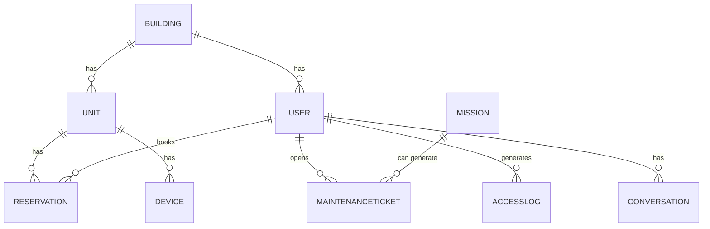

# Data Model: BuildingOS

## 1. Conceptual Data Model

This section identifies the core entities of the BuildingOS ecosystem.

*   **Building:** Represents a single condominium or building, holding its specific configurations.
*   **User:** The central entity for any person interacting with the system (resident, guest, staff).
*   **Reservation:** Represents a short-term rental booking for a specific unit.
*   **Mission:** The execution plan created by the `agent_director` to fulfill a user request.
*   **MaintenanceTicket:** A record of a maintenance request from a user.
*   **Device:** A physical, integrated device (e.g., a smart lock, camera, sensor).
*   **AccessLog:** A log entry for an access event (e.g., a door being opened).
*   **Conversation:** The message history for a specific chat session.

---

## 2. Logical Data Model

This section details the attributes and relationships for each core entity.

### 2.1. Entity Relationship Diagram (ERD)

*This diagram shows the high-level relationships between the core entities.*



### 2.2. Entity Details

Each entity is described in its own dedicated file.

*   **[User](./user-entity.md):** The central entity for any person interacting with the system.
*   **[Building](./building-entity.md):** Represents a single building and its configurations.
*   **[Unit](./unit-entity.md):** Represents a specific apartment or unit within a building.
*   **[Reservation](./reservation-entity.md):** A short-term rental booking for a specific unit.
*   **[Device](./device-entity.md):** A physical, integrated device (e.g., a smart lock, camera, sensor).
*   **[AccessLog](./accesslog-entity.md):** A log entry for an access event.
*   **[MaintenanceTicket](./maintenanceticket-entity.md):** A record of a maintenance request.
*   **[Conversation](./conversation-entity.md):** The message history for a specific chat session.
*   **[Mission](./mission-entity.md):** The execution plan created by the `agent_director`.

---

## 3. Technology Choices

The data layer is built on a serverless-first principle, utilizing the following AWS services:

*   **AWS DynamoDB:** The primary database for structured, operational data. Used for storing user profiles, reservation details, mission states, and logs. Its key-value and document model provides the flexibility and scalability required.
*   **AWS S3 (Simple Storage Service):** Used for storing unstructured data (files), such as documents for check-in, photos from maintenance tickets, and financial reports (bills).
*   **Amazon OpenSearch (or Vector Engine):** Used as the vector database to store embeddings for the RAG (Retrieval-Augmented Generation) functionality of the `agent_persona`.

---

## 4. Physical Data Model (DynamoDB Design)

This section describes the specific DynamoDB table design, focusing on access patterns and performance optimization.

### 4.1. Table Design Principles

*   **Single Table Design:** All entities stored in one DynamoDB table for efficient queries
*   **GSI (Global Secondary Indexes):** Used for alternative access patterns
*   **TTL (Time To Live):** Automatic cleanup of temporary data
*   **Encryption:** AES-256 encryption at rest and in transit

### 4.2. Main Table Schema

**Table Name:** `bos-data-{environment}`

| Attribute | Type | Description | Access Pattern |
|-----------|------|-------------|----------------|
| `PK` | String | Partition Key | Primary access pattern |
| `SK` | String | Sort Key | Secondary access pattern |
| `GSI1PK` | String | GSI1 Partition Key | Alternative queries |
| `GSI1SK` | String | GSI1 Sort Key | Alternative queries |
| `GSI2PK` | String | GSI2 Partition Key | Time-based queries |
| `GSI2SK` | String | GSI2 Sort Key | Time-based queries |
| `data` | Map | Entity data | Flexible schema |
| `created_at` | String | ISO 8601 timestamp | Audit trail |
| `updated_at` | String | ISO 8601 timestamp | Audit trail |
| `ttl` | Number | Unix timestamp | Auto-cleanup |

### 4.3. Access Patterns & Key Design

#### **Building Configuration**
```
PK: BUILDING#{building_id}
SK: CONFIG
GSI1PK: BUILDING
GSI1SK: {building_id}
```

#### **User Profile**
```
PK: BUILDING#{building_id}
SK: USER#{user_id}
GSI1PK: USER
GSI1SK: {user_id}#{building_id}
```

#### **Reservation**
```
PK: BUILDING#{building_id}
SK: RESERVATION#{reservation_id}
GSI1PK: UNIT
GSI1SK: {unit_id}#{check_in_date}
GSI2PK: RESERVATION
GSI2SK: {check_in_date}#{reservation_id}
```

#### **Mission State**
```
PK: BUILDING#{building_id}
SK: MISSION#{mission_id}
GSI1PK: USER
GSI1SK: {user_id}#{created_at}
GSI2PK: MISSION
GSI2SK: {status}#{created_at}
```

#### **Access Log**
```
PK: BUILDING#{building_id}
SK: ACCESS#{timestamp}#{user_id}
GSI1PK: USER
GSI1SK: {user_id}#{timestamp}
GSI2PK: ACCESS
GSI2SK: {date}#{timestamp}
```

#### **Conversation**
```
PK: BUILDING#{building_id}
SK: CONVERSATION#{conversation_id}
GSI1PK: USER
GSI1SK: {user_id}#{conversation_id}
GSI2PK: CONVERSATION
GSI2SK: {date}#{conversation_id}
```

### 4.4. Indexes Configuration

#### **GSI1: Entity-Based Queries**
- **Purpose:** Query by entity type across buildings
- **Capacity:** 5 RCU, 5 WCU (auto-scaling enabled)
- **Use Cases:** 
  - Find all users across buildings
  - List all reservations for a unit
  - Get all missions for a user

#### **GSI2: Time-Based Queries**
- **Purpose:** Query by time ranges and status
- **Capacity:** 10 RCU, 10 WCU (auto-scaling enabled)
- **Use Cases:**
  - Recent access logs
  - Active missions
  - Upcoming reservations

### 4.5. Data Lifecycle Management

#### **TTL Configuration**
```json
{
  "conversation": 30,           // 30 days
  "access_log": 90,             // 90 days
  "mission": 7,                 // 7 days
  "temp_data": 24               // 24 hours
}
```

#### **Backup Strategy**
- **Point-in-Time Recovery:** Enabled for 35 days
- **On-Demand Backups:** Before major deployments
- **Cross-Region Replication:** For disaster recovery

### 4.6. Performance Optimization

#### **Read Capacity Optimization**
- **Consistent Reads:** Only for critical operations (user authentication)
- **Eventually Consistent:** For most queries (conversations, logs)
- **Batch Operations:** For bulk data retrieval

#### **Write Capacity Optimization**
- **Batch Writes:** Up to 25 items per batch
- **Conditional Writes:** For data integrity
- **Auto-Scaling:** Based on CloudWatch metrics

### 4.7. Security & Compliance

#### **Encryption**
- **At Rest:** AES-256 encryption
- **In Transit:** TLS 1.2+ encryption
- **Key Management:** AWS KMS customer managed keys

#### **Access Control**
- **IAM Policies:** Least privilege access
- **VPC Endpoints:** Private network access
- **CloudTrail:** All API calls logged

#### **Data Protection**
- **Field-Level Encryption:** For sensitive data (PII)
- **Data Masking:** In logs and exports
- **Retention Policies:** Compliance with data regulations
