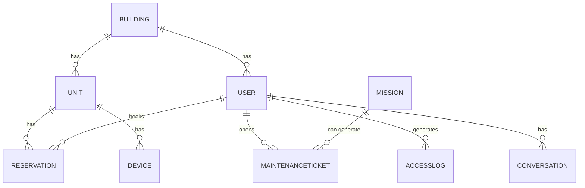

# Data Model: BuildingOS

## 1. Conceptual Data Model

This section identifies the core entities of the BuildingOS ecosystem.

*   **Building:** Represents a single condominium or building, holding its specific configurations.
*   **User:** The central entity for any person interacting with the system (resident, guest, staff).
*   **Reservation:** Represents a short-term rental booking for a specific unit.
*   **Mission:** The execution plan created by the `agent_director` to fulfill a user request.
*   **MaintenanceTicket:** A record of a maintenance request from a user.
*   **Device:** A physical, integrated device (e.g., a smart lock, camera, sensor).
*   **AccessLog:** A log entry for an access event (e.g., a door being opened).
*   **Conversation:** The message history for a specific chat session.

---

## 2. Logical Data Model

This section details the attributes and relationships for each core entity.

### 2.1. Entity Relationship Diagram (ERD)

*This diagram shows the high-level relationships between the core entities.*

### 2.2. Entity Details

Each entity is described in its own dedicated file.

*   **[User](./user-entity.md):** The central entity for any person interacting with the system.
*   **[Building](./building-entity.md):** Represents a single building and its configurations.
*   **[Unit](./unit-entity.md):** Represents a specific apartment or unit within a building.
*   **[Reservation](./reservation-entity.md):** A short-term rental booking for a specific unit.
*   **[Device](./device-entity.md):** A physical, integrated device (e.g., a smart lock, camera, sensor).
*   **[AccessLog](./accesslog-entity.md):** A log entry for an access event.
*   **[MaintenanceTicket](./maintenanceticket-entity.md):** A record of a maintenance request.
*   **[Conversation](./conversation-entity.md):** The message history for a specific chat session.
*   **[Mission](./mission-entity.md):** The execution plan created by the `agent_director`.

---

## 3. Technology Choices

The data layer is built on a serverless-first principle, utilizing the following AWS services:

*   **AWS DynamoDB:** The primary database for structured, operational data. Used for storing user profiles, reservation details, mission states, and logs. Its key-value and document model provides the flexibility and scalability required.
*   **AWS S3 (Simple Storage Service):** Used for storing unstructured data (files), such as documents for check-in, photos from maintenance tickets, and financial reports (bills).
*   **Amazon OpenSearch (or Vector Engine):** Used as the vector database to store embeddings for the RAG (Retrieval-Augmented Generation) functionality of the `agent_persona`.

---

## 4. Physical Data Model (DynamoDB Design)

This section describes the specific DynamoDB table design, focusing on access patterns.

*(We will design this based on the logical model)*
